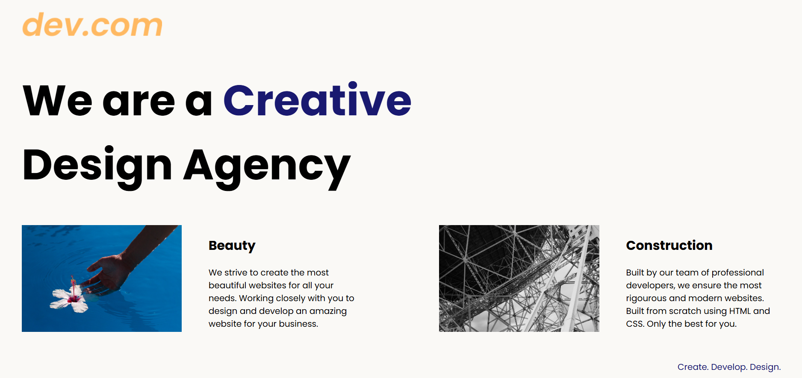

## web Agency
A simple Web Agency website built using HTML & CSS

# Creative Design Agency Website
This project is a simple, elegant, and responsive landing page for a Creative Design Agency, built using HTML and CSS. It highlights the agency’s services with visually appealing card sections and focuses on clean typography and layout.

# Features
•Fully responsive layout using media queries
•Clean and modern UI using Poppins Google font
•Card-based layout for showcasing services
•Mobile-friendly design
•Minimal and aesthetically pleasing styling

# Preview
1. Desktop View
•Large headline
•Two service cards aligned left and right
•Floating image layout

2. Mobile View
•Center-aligned heading
•Stacked cards
•Full-width images

